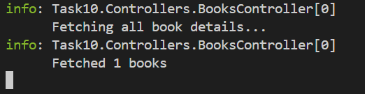
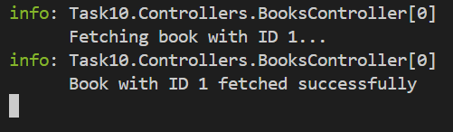

# Building a Mini Microservice with ASP.NET Core

## Objective

To build a simple RESTful API using **ASP.NET Core** that manages a **Books** resource, demonstrating best practices like **Dependency Injection**, **async/await**, and **Entity Framework Core** with an **in-memory database**.

## What I did 

- Created a Web API project with proper controller setup (`BooksController`)
- Built a `Book` model and connected it via EF Core
- Implemented a service layer (`IBookService`, `BookService`)
- Registered services using Dependency Injection
- Used an **in-memory database** for CRUD operations
- Applied `async/await` to all controller and service methods
- Integrated basic **error handling** using exceptions
- Logged key events and failures using **ILogger**

## Output

### Post method

- Using Postman

- Logger

### Get method

- Using Postman

- Logger

### GetByID method

- Using Postman

- Logger

### Put method

- Using Postman

- Logger

### Delete method

- Using Postman

- Logger

