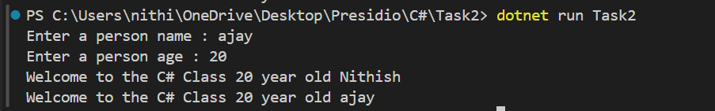

# Simple Object-Oriented Programming 

## Notes
- If you don't write any constructor, Compiler automatically create default one.
- If you write parameterized constructor , You have to manually write default construtor.
- It will affect while initiating object for class.

## Learned things
- Properties and get,set built-in keywords

## Output
