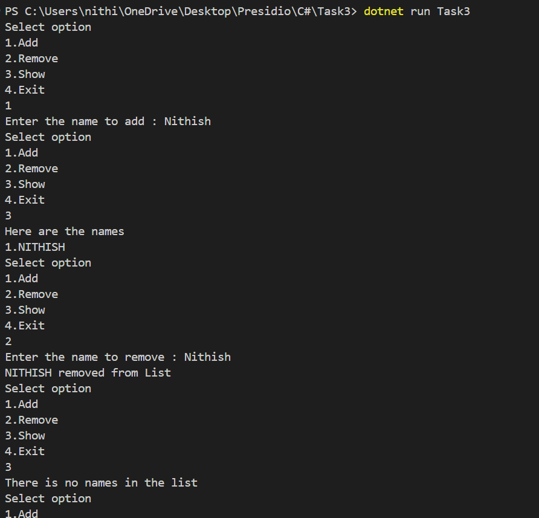

# Basic Collections and String Manipulation

## Learned concepts
- Collection categories like non-generic and generic.
- Skimmed over the all collections.
- Used the List<T> and it's methods in this task.
- **String manipulation** 
 -- Read all the methods of sting manipulation.
 -- Used two methods in this task.

## Output
