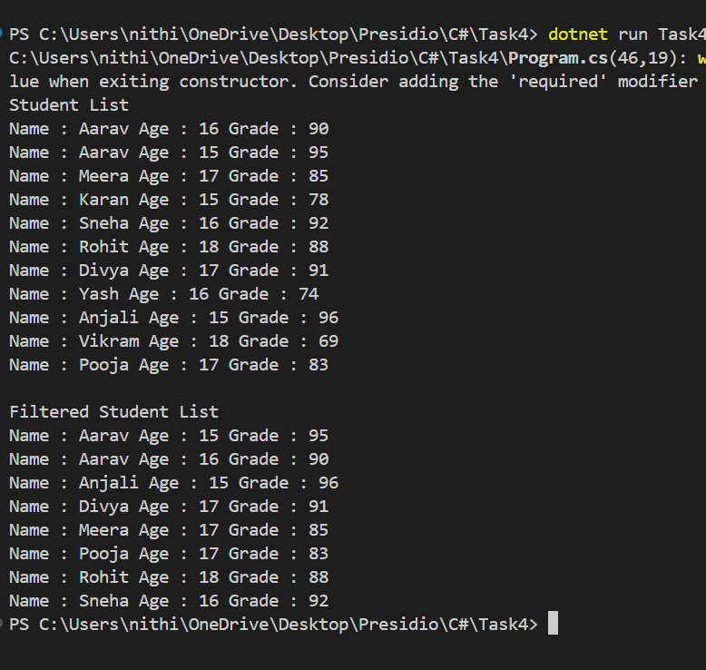

# Working with Collections and LINQ

## What I have done here
 - First I created a class for student which contains the name,age and grade properties.
 - I used list to store 10 students data which list of Students `List<Student> students`.
 - And used LINQ methods to filter(`Where`) and sort(`OrderBy`,`ThenBy`) data which is stored in another list.
 - By using `ToList()`, I converted the return data from this`IOrderedEnumerable<Student>` to `List<Student>`.
 

## Learned Things
- LINQ which is used to save and retrive data from collection like SQL.
- Two types of syntax 
 -- Method syntax
    --- Used this in the task. We can methods to filter and sort data.
 -- Query syntax
    --- It's like SQL query. Have write query to filter and sort data.

## Output
