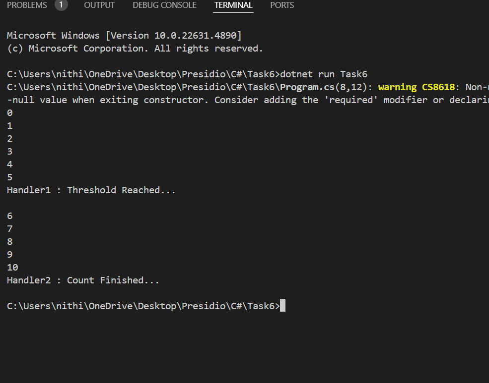

# Delegates, Events, and Basic Event Handling

## What I did
- Implements a `Counter` class that raises an event at a **threshold value** or the **end of counting**.
- Uses a **custom delegate** `ThresholdHandler`.
- Demonstrates **multiple event handler methods**.
- Dynamically **adds and removes handlers** at runtime.
- Showcases **decoupling** between the counter logic and the consumer response.

## Notes
- **EventHandler** is a default delegate so you don't need to define it like custom delegate. You can directly include it while defining event.
- `static` If I don't use it I have to create object.

## Output
