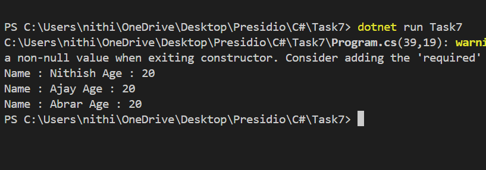

# Asynchronous Programming and Multi-threading

## What It Does
- Creates a list of `Person` objects
- Simulates fetching each person's details with a delay
- Uses `Task.Delay()` to mimic API processing
- Runs all tasks concurrently and waits using `Task.WhenAll`
- Displays each person's details after all tasks complete

## Notes 
- Each `PersonDetails()` method waits 3 seconds using `Task.Delay` but when using `Task.WhenAll`, It aggregates all the results and finishes all the task within 3 seconds instead of taking 9 seconds

## Sample Output

