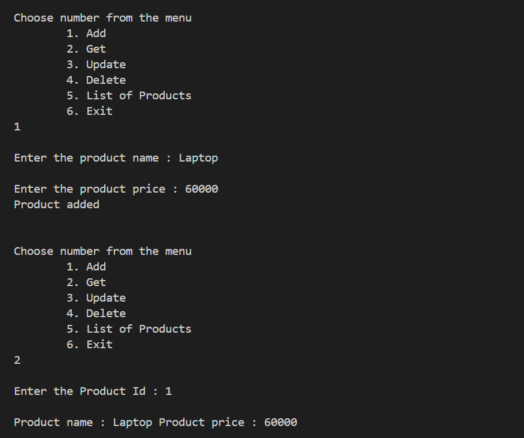

# Generics & Interfaces with Repository Pattern

## What I Learned

- How to use **generics** in C# to make reusable code.
- How to create an **interface** (`IRepository<T>`) and implement it in a clean way.
- Got a good grasp of the **repository pattern** — basically keeping data logic separate and neat.
- Used an in-memory `Dictionary` to act like a mini database, no need for real DBs here.

## How I Implemented It Here

1. **Created a Generic Interface (`IRepository<T>`)**  
   - Defined standard methods: `Add`, `Get`, `Update`, `Delete`, `GetAll`.

2. **Implemented the Interface with a Generic Class (`Repository<T>`)**  
   - Used `Dictionary<int, T>` to store data in-memory.
   - Applied a type constraint: `where T : class`.

3. **Used a Sample Entity (`Product`)**  
   - Demonstrated the repository with a simple class having properties like `Id`, `Name`, and `Price`.

## Ouputs

1. Add and Get

2. Update and GetAll

3. Delete, GetAll and exit

