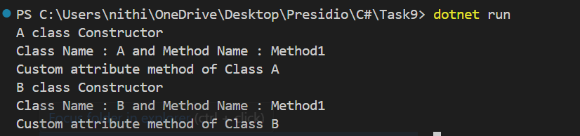

# Reflection and Custom Attributes

## Objective

Build an application that discovers and executes methods based on custom attributes.

### What is Reflection

Reflection is a feature in C# that allows you to **inspect and interact with assemblies, classes, methods, and attributes at runtime**.

#### Methods of refelection

- `Assembly.GetExecutingAssembly()` – Get the currently running assembly.
- `assembly.GetTypes()` – Get all defined types (classes) in the assembly.
- `type.IsClass`, `type.IsAbstract` – Filter only concrete classes.
- `Activator.CreateInstance(type)` – Dynamically create an object of a class.
- `type.GetMethods(BindingFlags.Public | BindingFlags.Instance)` – Get all public instance methods.
- `method.Invoke(obj, null)` – Invoke the method dynamically at runtime.

### What is Attributes

- Attributes in C# are metadata tags used to add information to code elements.  
- They are of two types: **Built-in attributes** (like `[Obsolete]`, `[Serializable]`) and **Custom attributes** (like your `[Runnable]`).

#### Attribute-Related Code Used
- `[AttributeUsage(AttributeTargets.Method)]` – Specifies that the custom attribute can be applied to methods.
- `method.GetCustomAttribute<RunnableAttribute>()` – Checks if a method is marked with `[Runnable]`.

### What This Code Does

1. Defines a custom attribute `[Runnable]` that can be applied to methods.
2. Creates two example classes `A` and `B`, each with methods and some decorated with `[Runnable]`.
3. Uses **reflection** to:
   - Scan the current assembly.
   - Create instances of classes.
   - Look for public methods with the `[Runnable]` attribute.
   - Dynamically **invoke only the methods** marked with `[Runnable]`.
4. Displays the class and method names of the executed methods in the console.

### Output

